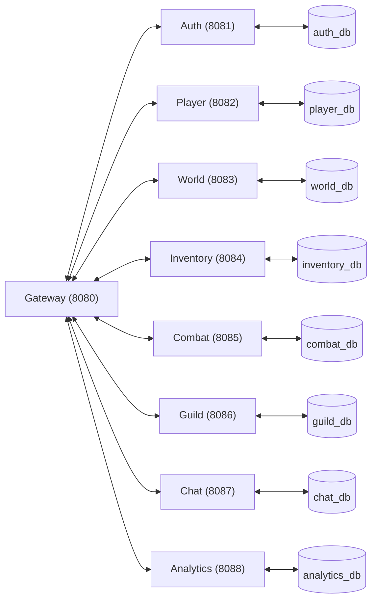

[](https://github.com/cafe1231/github_mmorpg/actions/workflows/ci.yml)

# MMORPG Microservices

Projet complet de MMORPG distribué en architecture microservices (Go, PostgreSQL, Docker, Prometheus).

---

## 🏗️ Architecture Générale



- **Gateway** : Reverse proxy, sécurité, monitoring, endpoints d’orchestration
- **Chaque service** : API REST, base PostgreSQL dédiée, migrations, monitoring

---

## 🚀 Démarrage rapide

1. **Cloner le projet**
   ```bash
   git clone <repo_url>
   cd github_mmorpg
   ```
2. **Lancer toute l’architecture**
   ```bash
   docker-compose up --build
   ```
3. **Accéder aux services**
   - Gateway : http://localhost:8080
   - Auth : http://localhost:8081
   - Player : http://localhost:8082
   - World : http://localhost:8083
   - Inventory : http://localhost:8084
   - Combat : http://localhost:8085
   - Guild : http://localhost:8086
   - Chat : http://localhost:8087
   - Analytics : http://localhost:8088

---

## 🧩 Liste des services

| Service     | Port   | Description                        | Documentation                |
|-------------|--------|------------------------------------|------------------------------|
| Gateway     | 8080   | Reverse proxy, sécurité, monitoring| [docs](services/gateway/README.md) |
| Auth        | 8081   | Authentification, sessions         | [docs](services/auth-new/README.md) |
| Player      | 8082   | Profils joueurs, personnages       | [docs](services/player/README.md) |
| World       | 8083   | Zones, NPCs, météo, événements     | [docs](services/world/README.md) |
| Inventory   | 8084   | Inventaire, items, échanges        | [docs](services/inventory/README.md) |
| Combat      | 8085   | Système de combat, PvP             | [docs](services/combat/README.md) |
| Guild       | 8086   | Guildes, membres, logs, guerres    | [docs](services/guild/README.md) |
| Chat        | 8087   | Communication temps réel           | [docs](services/chat/README.md) |
| Analytics   | 8088   | Collecte d’événements, métriques   | [docs](services/analytics/README.md) |

---

## 📦 Structure du projet

```
/ (racine)
├── docker-compose.yml         # Orchestration multi-services
├── Makefile                   # Automatisation (à compléter)
├── README.md                  # Ce fichier
├── services/                  # Tous les microservices
│   ├── gateway/
│   ├── auth-new/
│   ├── player/
│   ├── world/
│   ├── inventory/
│   ├── combat/
│   ├── guild/
│   ├── chat/
│   └── analytics/
├── shared/                    # Modèles, proto, utilitaires communs
├── infrastructure/            # Docker, Kubernetes, scripts infra
├── scripts/                   # Déploiement, migration, outils
└── docs/                      # Documentation additionnelle
```

---

## 🛡️ Conventions et bonnes pratiques
- **Bases de données** : une par service, nommée `<service>_db`, utilisateur `auth_user`
- **Sécurité** : JWT, rate limiting, CORS, logs structurés
- **Monitoring** : Prometheus sur chaque service (`/metrics`)
- **Langue** : Documentation et commentaires en français
- **Migrations** : SQL up/down dans chaque service
- **Tests** : Structure prête pour tests unitaires et d’intégration

---

## 🔗 Liens utiles
- [Guide Docker Compose](https://docs.docker.com/compose/)
- [Go Documentation](https://golang.org/doc/)
- [PostgreSQL Documentation](https://www.postgresql.org/docs/)
- [Prometheus](https://prometheus.io/)

---

## 📅 Prochaines étapes
- Compléter le Makefile pour automatiser build, test, migration, docker
- Mettre en place la suite de tests d’intégration
- Ajouter des schémas d’architecture détaillés dans `/docs`
- Sécuriser les secrets (fichiers `.env`, vault, etc.)
- CI/CD (GitHub Actions, GitLab CI, etc.)

---

**Projet MMORPG Microservices – 2024**
